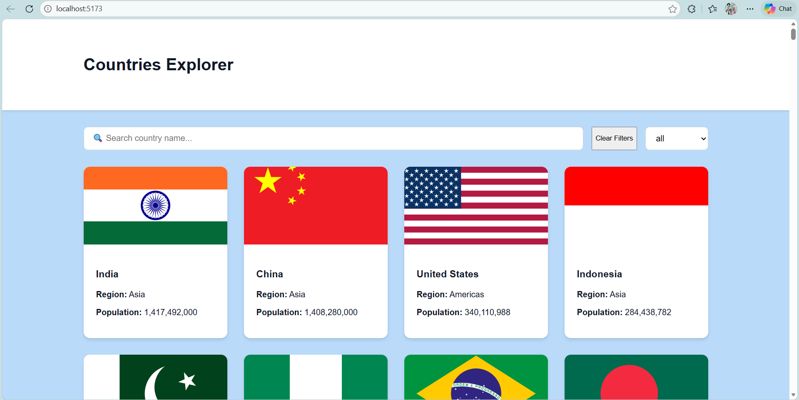
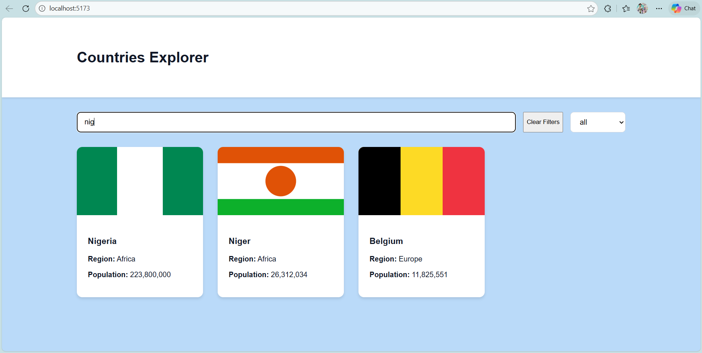
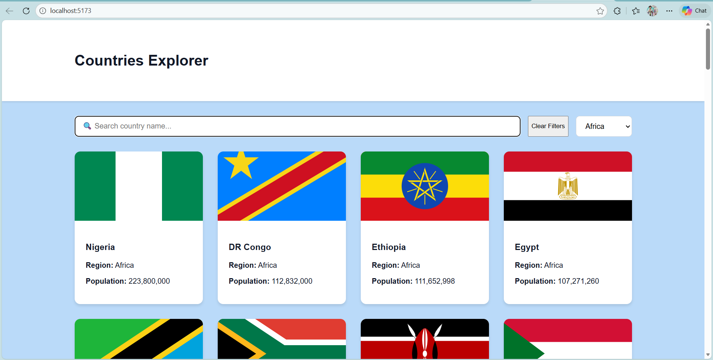

# 🌍 Countries Explorer - React Application

A modern, responsive, and robust web application built with **React** that allows users to explore data about countries worldwide using the REST Countries API.

## 🚀 Features & Mandatory Requirements
This project fulfills all the mandatory requirements for the Week 3 Assignment:
* **State Management:** Efficiently manages `countries`, `loading`, `error`, `search`, and `region` states.
* **Dynamic Search:** Search for countries by name with integrated error handling.
* **Regional Filtering:** Filter countries by continents (Africa, Americas, Asia, Europe, Oceania).
* **Advanced Fetch Logic:** Uses `useEffect` with a proper dependency array `[search, region]` to trigger API calls.
* **Error & Loading States:** Professional UI feedback during data fetching and a functional **Retry** button for error recovery.
* **Data Safety:** Implements defensive programming to prevent crashes if certain API fields (like flags or names) are missing.

---

## ✨ Bonus Features Implemented (4/2)
I have exceeded the requirements by implementing **four** bonus features:
1. **Sort by Population (High → Low):** Countries are automatically sorted so that the most populous nations appear first.
2. **Debounced Search:** Implemented a **500ms delay** using `setTimeout` in `useEffect` to optimize performance and reduce unnecessary API calls while typing.
3. **"No Results Found" UI:** A user-friendly message appears when a search query or filter doesn't match any country.
4. **Clear Filters Button:** A dedicated button to instantly reset both the search input and the region dropdown.

---

## 📡 API Endpoints Used
The application interacts with the following REST Countries V3.1 endpoints:
* **All Countries:** `https://restcountries.com/v3.1/all?fields=name,flags,region,population,cca3`
* **Search by Name:** `https://restcountries.com/v3.1/name/{name}?fields=name,flags,region,population,cca3`
* **Filter by Region:** `https://restcountries.com/v3.1/region/{region}?fields=name,flags,region,population,cca3`

---

## 📸 Screenshots

### 🏠 Home Page
Shows the initial load with countries sorted by population.

---

### 🔍 Results & Filtering
In these views, you can see how the app handles searching by name and filtering by region.

#### 1. Searching by Country Name

#### 2. Filtering by Region (e.g., Africa)

